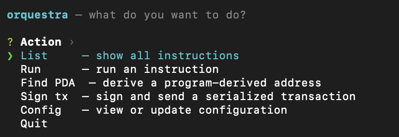

# orquestra-cli

A fast Rust CLI for interacting with Solana programs via [orquestra.dev](https://orquestra.dev).

Upload your Anchor IDL to orquestra once, **or point the CLI directly at a local IDL JSON file** — this tool turns every instruction into an interactive prompt, builds the transaction, and optionally signs and sends it to Solana using your local keypair.



---

## Features

- **List instructions** — fetch and display all instructions for your program
- **Interactive run** — fuzzy-select an instruction, answer prompted questions for each arg and account
- **Find PDA** — derive program-derived addresses by fuzzy-selecting a PDA account and supplying seed values
- **Local IDL file mode** — point the CLI at a Solana/Anchor IDL JSON file and operate fully offline without an Orquestra account
- **Auto-fill signers** — if a keypair is configured, signer accounts are pre-filled with your public key
- **Auto-derive PDAs** — PDA accounts whose seeds are fully resolvable from your inputs are derived silently; fixed-address accounts (system_program, token_program, etc.) are filled automatically
- **Sign & send** — signs the built transaction with your local keypair and broadcasts to Solana via JSON-RPC
- **Keypair-free mode** — prints the base58-encoded unsigned transaction for manual wallet signing
- **Interactive menu** — run `orquestra` with no arguments to get a top-level action picker
- **Persistent config** — stores settings in `~/.config/orquestra/config.toml`

---

## Installation

### Homebrew (macOS)

```bash
brew tap berkayoztunc/orquestra-cli https://github.com/berkayoztunc/orquestra-cli
brew install orquestra-cli
```

### Download binary

Grab the latest binary for your platform from the [Releases](https://github.com/berkayoztunc/orquestra-cli/releases) page.

| Platform       | File                                          |
|----------------|-----------------------------------------------|
| macOS arm64    | `orquestra-vX.X.X-aarch64-apple-darwin.tar.gz`  |
| macOS x86_64   | `orquestra-vX.X.X-x86_64-apple-darwin.tar.gz`   |
| Linux x86_64   | `orquestra-vX.X.X-x86_64-unknown-linux-gnu.tar.gz` |
| Linux arm64    | `orquestra-vX.X.X-aarch64-unknown-linux-gnu.tar.gz` |

Extract and move to your PATH:

```bash
tar -xzf orquestra-*.tar.gz
mv orquestra /usr/local/bin/
```

### Build from source

Requires [Rust](https://rustup.rs) 1.75+.

```bash
git clone https://github.com/berkayoztunc/orquestra-cli
cd orquestra-cli
cargo build --release
# binary is at target/release/orquestra
```

---

## Setup

The CLI has two operating modes. Choose the one that fits your workflow:

| Mode | When to use |
|------|-------------|
| **API mode** (default) | You have an Orquestra account and API key. All instruction metadata is fetched from the cloud. |
| **Local IDL file mode** | You have a Solana/Anchor IDL JSON file locally and prefer not to use the Orquestra API. Works fully offline. |

---

### API mode setup

#### 1. Get your project ID and API key

Sign in at [orquestra.dev](https://orquestra.dev), upload your Anchor IDL, and generate an API key from the dashboard.

#### 2. Configure the CLI

```bash
orquestra config set \
  --project-id <your-project-id> \
  --api-key    <your-api-key>    \
  --rpc        https://api.mainnet-beta.solana.com \
  --keypair    ~/.config/solana/id.json
```

| Flag           | Description                                              | Default                              |
|----------------|----------------------------------------------------------|--------------------------------------|
| `--project-id` | Orquestra project slug or program address                | —                                    |
| `--api-key`    | `X-API-Key` header value from the dashboard              | —                                    |
| `--rpc`        | Solana RPC endpoint                                      | `https://api.mainnet-beta.solana.com` |
| `--keypair`    | Path to Solana keypair JSON (standard CLI format)        | —                                    |
| `--api-base`   | Orquestra API base URL                                   | `https://api.orquestra.build`        |

> The keypair is optional. Without it the CLI prints the unsigned base58 transaction for you to sign with any wallet.

#### 3. Verify config

```bash
orquestra config show
```

```
project_id  : my-program
api_key     : sk_t***y123
rpc_url     : https://api.mainnet-beta.solana.com
keypair_path: /Users/alice/.config/solana/id.json
api_base_url: https://api.orquestra.build
idl_path    : (not set)
```

---

### Local IDL file mode setup

If you have a Solana/Anchor IDL JSON file (e.g. exported from `anchor build` or downloaded from the chain), you can skip the Orquestra API entirely.

#### 1. Point the CLI at your IDL file

```bash
orquestra config set \
  --idl     /path/to/program.json \
  --rpc     https://api.mainnet-beta.solana.com \
  --keypair ~/.config/solana/id.json
```

| Flag       | Description                                       |
|------------|---------------------------------------------------|
| `--idl`    | Absolute or relative path to the IDL JSON file    |
| `--rpc`    | Solana RPC endpoint used for sign & send          |
| `--keypair`| Path to Solana keypair JSON (optional)            |

> When `idl_path` is set the CLI operates in **file mode** — no Orquestra account or API key required.  
> To switch back to API mode, clear the field: `orquestra config set --idl ""`

#### 2. Verify config

```bash
orquestra config show
```

```
program_id  : (not set)
api_key     : (not set)
rpc_url     : https://api.mainnet-beta.solana.com
keypair_path: /Users/alice/.config/solana/id.json
api_base_url: https://api.orquestra.dev
idl_path    : /path/to/program.json
```

#### Supported IDL format

The CLI parses the **native Solana/Anchor IDL JSON format** — the same file produced by `anchor build` (found at `target/idl/<program>.json`) or fetchable via `anchor idl fetch <program-id>`.

Supported Borsh argument types: `string`, `u8`, `u16`, `u32`, `u64`, `u128`, `i8`, `i16`, `i32`, `i64`, `i128`, `bool`, `pubkey`.

Complex/nested struct types require API mode.

---

## Usage

```bash
orquestra list
```

```
▸ 4 instructions in my-program

  initialize    Initializes a new vault account
  deposit       Deposit tokens into the vault
  withdraw      Withdraw tokens from the vault
  close         Close the vault and reclaim rent
```

### Run an instruction (interactive)

```bash
orquestra run
```

Fuzzy-select from the instruction list, then answer each prompt:

```
? Select instruction  › deposit

Instruction: deposit

Arguments
  amount (u64): 1000000

Accounts
  authority [signer]: Gk3...abc  (pre-filled from keypair)
  vault [mut]:        Fv9...xyz

────────────────────────────────────────
Summary
  Instruction : deposit
  Args        :
    amount = 1000000
  Accounts    :
    authority = Gk3...abc
    vault     = Fv9...xyz
  Fee payer   : Gk3...abc
────────────────────────────────────────

? Build transaction for 'deposit'? › Yes

✓ Transaction built successfully!
  Estimated fee : 5000 lamports

? Sign and send transaction to Solana? › Yes

✓ Transaction confirmed!
  Signature : 5KtP...Xz
  Explorer  : https://explorer.solana.com/tx/5KtP...Xz
```

### Run a specific instruction directly

```bash
orquestra run deposit
```

Skips the selection menu and goes straight to the argument prompts.

### Without a keypair

If no keypair is configured the CLI prints the unsigned transaction:

```
Base58 encoded transaction (unsigned):
  4h8nK3F9x2rP...vQm7L2wN

  Sign with your wallet and broadcast to Solana.
  https://orquestra.dev/docs/sign-and-send
```

### Find PDA (interactive)

```bash
orquestra pda
```

Fuzzy-select from the list of PDA accounts defined in your program's IDL, enter seed values, and the CLI derives the address:

```
▸ 2 PDA accounts in my-program (BUYu...)

? Select PDA account  › vault (owner)

Seed values
  owner (publicKey): Gk3...abc

✓ PDA derived!

  Address:   Fv9...xyz
  Bump:      254
  Program:   BUYu...

Seeds:
  const  vault_seed        [76617...]
  arg    owner             = Gk3...abc [0a1b...]
```

### Derive a specific PDA directly

```bash
orquestra pda vault
```

Skips the selection menu and goes straight to seed prompts.

---

## Command reference

```
orquestra                              # interactive top-level menu
orquestra list
orquestra run [INSTRUCTION]
orquestra pda [ACCOUNT]
orquestra config set [--project-id] [--api-key] [--rpc] [--keypair] [--api-base] [--idl]
orquestra config show
orquestra config reset                  # interactively update config values
orquestra --version
orquestra --help
```

---

## Keypair format

The CLI uses the standard Solana CLI keypair format — a JSON file containing a 64-byte array:

```json
[12,34,56,...] // 64 bytes: first 32 = secret seed, last 32 = public key
```

Generate one with the Solana CLI:

```bash
solana-keygen new --outfile ~/.config/solana/id.json
```

---

## Distribution

### Releasing a new version

1. Bump `version` in `Cargo.toml`
2. Push a tag: `git tag v0.2.0 && git push --tags`
3. GitHub Actions compiles binaries for all 4 platforms, creates a GitHub Release, and updates `Formula/orquestra-cli.rb` with the new SHA256 checksums automatically

### Custom tap (already set up)

```bash
brew tap berkayoztunc/orquestra-cli https://github.com/berkayoztunc/orquestra-cli
brew install orquestra-cli
brew upgrade orquestra-cli
```

---

## License

This project is licensed under the MIT License. See [LICENSE](LICENSE) for details.


<div align="center">

**[Website](https://orquestra.dev)** • **[Twitter](https://twitter.com/whitemoondev)**

Made with ❤️ for the Solana ecosystem

⭐ **Star us on GitHub** — it motivates us to build better tools!

</div>